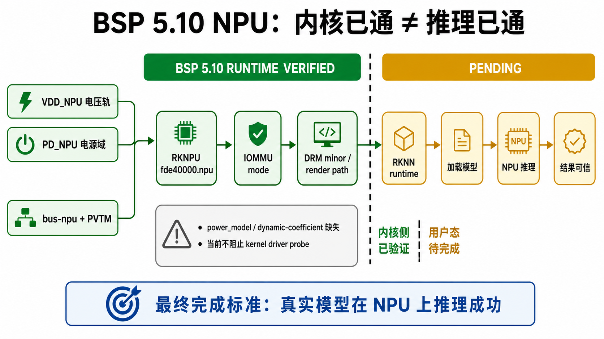

# 09 - NPU

RK3568 NPU 是当前选择 Rockchip BSP 5.10 而不是 mainline Linux 的重要原因之一。不过，文档中的状态要分层记录：kernel driver probe 成功不等于 RKNN 用户态推理已经完整跑通。



## 当前状态

| 层级 | 状态 | 证据 |
|------|------|------|
| NPU DT / bus path | `[BSP-5.10 RUNTIME VERIFIED]` | `rockchip,bus bus-npu` 已 probe，可从 nvmem 读取 PVTM，并完成电压档位配置。 |
| RKNPU kernel driver | `[BSP-5.10 RUNTIME VERIFIED]` | `RKNPU fde40000.npu` probe 成功，IOMMU mode 已启用；如出现 DRM minor / render node，可作为用户态入口证据继续记录。 |
| RKNN runtime inference | `[PENDING]` | 仍需要真实 RKNN 用户态模型加载和推理结果，才能标记 runtime NPU 完整跑通。 |

已验证 kernel-side 日志摘录：

```text
RKNPU fde40000.npu: Adding to iommu group 0
RKNPU fde40000.npu: RKNPU: rknpu iommu is enabled, using iommu mode
[drm] Initialized rknpu 0.9.8 20240828 for fde40000.npu on minor 1
RKNPU fde40000.npu: pvtm = 92120, from nvmem
RKNPU fde40000.npu: soc version=0, speed=3
```

同一次启动中出现的非致命 / 待处理 warning：

```text
RKNPU fde40000.npu: can't request region for resource [mem 0xfde40000-0xfde4ffff]
RKNPU fde40000.npu: failed to find power_model node
RKNPU fde40000.npu: RKNPU: failed to initialize power model
RKNPU fde40000.npu: RKNPU: failed to get dynamic-coefficient
```

这些 warning 应继续保留在笔记中，但从当前日志看，它们主要是性能模型 / 动态系数缺失，不阻止 RKNPU kernel driver probe。

## 所需证据

标记 driver-side support 已验证前，至少需要：

```text
rknpu driver probe succeeds
IOMMU path is healthy
expected device node / DRM render path appears
no fatal NPU power/bus/ack errors in dmesg
```

标记 runtime NPU 已验证前，至少需要：

```text
RKNN runtime present
sample model loads
inference completes on NPU
result is plausible
```

所以当前准确说法是：**RKNPU 内核驱动已 probe 并注册，RKNN 用户态推理仍待验证**。

## 常用日志 grep

在运行中的开发板上：

```bash
dmesg | grep -iE 'rknpu|npu|iommu|bus-npu|rknn|drm.*render|failed|get ack|timeout|error'
```

对保存下来的串口日志：

```bash
grep -iEn 'rknpu|npu|iommu|bus-npu|rknn|drm.*render|failed|get ack|timeout|error' boot.log
```

在开发机仓库里搜索日志和文档：

```bash
rg -n -i 'rknpu|npu|iommu|bus-npu|rknn|drm.*render|failed|get ack|timeout|error' logs docs
```

解读规则：grep 命中的行只是“需要人工判断的证据”。只有 probe path 和 RKNN runtime inference 都确认后，才能写成 NPU 完整跑通。
