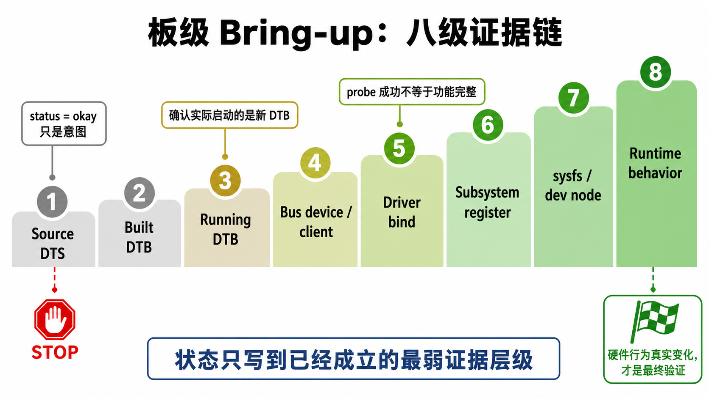

# 11 - 调试方法论

本项目采用“证据优先”的 Linux bring-up 方法。DTS 节点只是第一步，不等于功能已完成。

## 证据链



```text
1. Source DTS
2. Built DTB
3. Running DTB
4. Bus device or client exists
5. Driver binds
6. Subsystem registers
7. Sysfs or dev node appears
8. Runtime hardware behavior changes（运行时硬件行为变化）
```

状态表里只写“已经真实成立的最弱证据层级”。例如只看到 I2C client，就不能写成 IIO 传感器已通；只看到 driver probe，也不能写成用户态完整功能已通。

## 案例 A：BH1750 / MPU6050

```text
DTS correct
→ I2C clients exist
→ no IIO devices
→ inspect .config
→ Kconfig options missing
→ enable driver config
→ rebuild and boot
→ IIO devices appear
```

经验：client 创建成功不等于 driver 已绑定。

## 案例 B：Goodix

```text
GT911 probes
→ duplicate Goodix driver registration appears
→ inspect .config and Makefile/built-in path
→ GOODIX and legacy GT9XX stacks both enabled
→ keep only one driver family
→ registration conflict disappears
```

经验：名字相近的两套驱动可能在注册阶段冲突。

## 案例 C：MIPI-DSI

```text
early -517 probe defer
→ dependencies bind later
→ DRM registers fb0
→ final DSI link appears
→ display works
```

经验：`-517` 常见于正常 probe 顺序，不一定是最终失败。

## 案例 D：DTB

```text
source DTS modified
→ build succeeds
→ boot image updated
→ board actually boots new DTB
```

经验：source 变更不能证明 running DTB 已变化。排查 stale behavior 时，要检查 model、compatible、DT dump 或 image hash。

## 案例 E：BH1750「消失」误判

```text
grep 过滤过的 boot log 里没有 bh1750 probe 行
→ 误判「设备消失了」
→ 实际板端 /sys/bus/i2c/devices/2-0023 存在、name=bh1750
→ i2cdetect 显示 0x23=UU（设备被驱动占用）
→ 设备一直都在
```

经验：**判断「设备是否 probe」不能只看 grep 过的日志**。日志可能被 `head`/`tail`/`grep` 截断或漏掉某条 probe 行。要以下列板端实况为准：

```bash
i2cdetect -y 2                          # 地址是否出现 UU（有驱动占用）
ls /sys/bus/i2c/devices/                # 是否有 2-00xx client
cat /sys/bus/i2c/devices/2-0023/name    # driver 名
ls /sys/bus/iio/devices/iio:device2/    # IIO 属性是否齐全
```

且 IIO 属性名要以驱动源码为准：BH1750 是 `in_illuminance_raw`（不是 `in_illuminance_input`），读值前先 `ls` 确认，别凭猜的属性名下结论。
