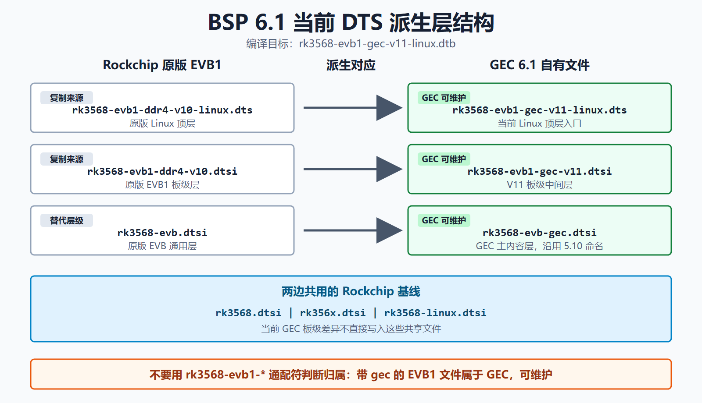

# 01 - 6.1 DTS 派生层与 override

> 状态：`[BSP-6.1 COMPILE VERIFIED / RUNTIME STATUS BY ITEM]` —— override 已编译并反编译核对；6.1 系统现已完成启动、HDMI、fb0 和部分 USB 运行验证，其余外设仍按各自日志判断，不能整体写成“全部未测”或“全部跑通”。



图中是 2026-08-28 起使用的 BSP 6.1 当前结构；本文件所列派生层至少已完成编译和反编译核对，运行状态以 `00_overview.md`、近期验证文档和长期裁剪日志为准。

## 当前编译目标与 include 层级

截至 2026-08-28，BSP 6.1 的编译目标是：

```text
RK_KERNEL_DTS_NAME="rk3568-evb1-gec-v11-linux"
目标 DTB：rk3568-evb1-gec-v11-linux.dtb
```

当前 include 关系：

```text
rk3568-evb1-gec-v11-linux.dts
├── #include "rk3568-evb1-gec-v11.dtsi"
│   ├── #include "rk3568.dtsi"
│   │   └── #include "rk356x.dtsi"
│   └── #include "rk3568-evb-gec.dtsi"
├── #include "rk3568-linux.dtsi"
├── #include <dt-bindings/display/rockchip_vop.h>
└── &vp0 / &vp1 cursor-win-id 设置
```

三个 GEC 文件的职责如下：

| 文件 | 当前职责 |
|------|----------|
| `rk3568-evb1-gec-v11-linux.dts` | Linux 顶层入口；连接 GEC 板级层与 `rk3568-linux.dtsi`，设置 VP cursor window |
| `rk3568-evb1-gec-v11.dtsi` | V11 板级中间层；model、regulator、GMAC1、I2C2、CAN1、UART、camera、RKISP、DSI route、SDMMC1 等 |
| `rk3568-evb-gec.dtsi` | GEC 主内容层；backlight、panel、PMIC、io-domain、pinctrl、USB PHY 等 |

## 文件来源与归属

| 当前文件 | 来源 | 当前归属与修改规则 |
|----------|------|--------------------|
| `rk3568-evb1-gec-v11-linux.dts` | 复制自 6.1 原版 `rk3568-evb1-ddr4-v10-linux.dts`，初始只替换 include | GEC 顶层文件，可修改 |
| `rk3568-evb1-gec-v11.dtsi` | 由 5.10 的 `rk3568-gec-v11.dtsi` 改名复制；核实时内容 diff 为 0 | GEC 板级文件，可修改 |
| `rk3568-evb-gec.dtsi` | 复制自 5.10 同名文件，进入 6.1 后有少量差异 | GEC 主内容文件，可修改 |
| `rk3568.dtsi` / `rk356x.dtsi` | 6.1 原生 SoC / 公共层 | 共享 Rockchip 基线，当前 GEC 适配不直接修改 |
| `rk3568-linux.dtsi` | 6.1 原生 Linux 通用层 | 共享 Rockchip 基线，当前 GEC 适配不直接修改 |

关键点：**不能用 `rk3568-evb1-*` 通配符判断文件是否属于 Rockchip 官方层。** `rk3568-evb1-gec-v11.dtsi` 带 EVB1 前缀，但它是 GEC 自有派生文件；`rk3568-evb-gec.dtsi` 虽沿用旧命名，也同样属于 GEC。

## 与 Rockchip EVB1 的替代关系

```text
Rockchip 原版 EVB1                       GEC 6.1 派生版
─────────────────────────────           ─────────────────────────────
rk3568-evb1-ddr4-v10-linux.dts    ->     rk3568-evb1-gec-v11-linux.dts
rk3568-evb1-ddr4-v10.dtsi         ->     rk3568-evb1-gec-v11.dtsi
rk3568-evb.dtsi                    ->     rk3568-evb-gec.dtsi
─────────────────────────────────────────────────────────────────────
rk3568.dtsi / rk356x.dtsi / rk3568-linux.dtsi 由两边共用
```

这里的“替代”是指 GEC 构建目标使用同层级的派生文件，不是覆盖或删除 Rockchip 原版文件。

## 当前维护流程

1. 先确认 `RK_KERNEL_DTS_NAME` 和实际生成的 DTB，避免分析旧的 `rk3568-gec-v11-*` 文件名。
2. 按上表确认节点属于顶层、V11 板级层还是 GEC 主内容层，再修改对应的带 `gec` 文件。
3. 与原版 EVB1、factory DTB 和 5.10 对照，把差异分类为 `BOARD_DELTA`、`BSP_DRIFT` 或 `ARTIFACT`。
4. 每批修改后编译 `rk3568-evb1-gec-v11-linux.dtb`，再反编译核对 include 合并结果。
5. 最后通过 running DTB、driver bind、sysfs / dev node 和真实行为逐级验证。

板级派生层仍可执行三类动作：

1. **覆盖值**（override），例如修改 `gmac1` 时序或路由属性。
2. **禁用错误继承**（disable wrong default），例如关闭 GEC 未使用的 EVB 默认节点。
3. **补回 GEC 独有节点**（re-add），例如板载传感器、panel 或 GPIO 控制节点。

**关键前提**：`4.19 EVB1 != 6.1 EVB1`，而 5.10 与 6.1 的 GEC 文件也不能只因来源相同就视为永久一致。任何复制操作之后，都要继续基于目标 BSP 和运行证据维护差异。

## 各 batch 落盘内容（均反编译核对通过）

### batch 基础外设

| 节点 | 落盘内容 |
|------|---------|
| `&gmac1` | `clock_in_out="input"`、`tx_delay=<0x41>`、`rx_delay=<0x1e>`、`snps,reset-gpio=<&gpio3 RK_PB5 GPIO_ACTIVE_LOW>`；M1 pinctrl + reset-active-low + reset-delays 继承 6.1 EVB1 不重复 |
| `&uart3` | `status="okay"`（M0 pinctrl 继承） |
| `&backlight` | `pwms=<&pwm4 0 1000000 0>`（1kHz） |
| HDMI 三件套 | 继承 EVB1 已 `okay`，不写 override |
| USB VBUS | `vcc5v0_host` 删 gpio/pinctrl（常开）；`vcc5v0_otg` gpio=A6 + boot-on + always-on + 保留 enable-active-high；`vcc5v0_otg_en` pins A6 |
| `&i2c2` | `status="okay"`、`pinctrl-0=<&i2c2m1_xfer>` + `bh1750@23` / `eeprom@50`(atmel,24c02) / `mpu6050@69`(invensense,mpu6050, interrupt GPIO3_B7, mount-matrix) |
| `&i2c0` | 加 `pcf8563@51` |

> 该基础 batch 当时明确不写 NPU（EVB1 已 enable，继承）、PCIe3x2、DSI0、触摸/WiFi/BT；CAN1 后续已按 GEC 接线单独启用，见下节。不能继续把“CAN1 保持 disabled”当成当前状态。

### batch CAN1（GPIO1_A0 / GPIO1_A1）

官方 `rk3568-evb.dtsi`、`rk3568-evb1-ddr4-v10.dtsi` 和顶层 EVB1 Linux DTS 都没有板级 `&can*` override；SoC 层 `rk356x.dtsi` 只定义资源并保持 `disabled`。GEC 当前覆盖为：

```dts
&can1 {
	compatible = "rockchip,rk3568-can-2.0";
	assigned-clocks = <&cru CLK_CAN1>;
	assigned-clock-rates = <200000000>;
	pinctrl-names = "default";
	pinctrl-0 = <&can1m0_pins>;
	status = "okay";
};
```

`can1m0_pins` 对应 GPIO1_A0/RX 与 GPIO1_A1/TX。其它板型使用的 `can1m1_pins` 对应 GPIO4_C2/C3，是另一组 PCB 接线，不能照搬。BSP 6.1 的 `rockchip,rk3568-can-2.0` 由 `rockchip_canfd.c` 匹配，必须同时启用 `CONFIG_CANFD_ROCKCHIP=y`；5.10 的 `CONFIG_CAN_RK3568` 在当前 6.1 Kconfig 中不存在。板端已验证 DTS `can1` 注册为 SocketCAN `can0`，详见 [RK3568 CAN1 控制器修复与验证](08_can_rk3568_2026-08-29.md)。

### batch Touch（GT911）

- `&i2c1 { /delete-node/ gt1x@14; }` 删 EVB1 的 `goodix,gt1x`。
- 加 `gt911@5d`：`compatible="goodix,gt911"`、`reg=<0x5d>`、`interrupt-parent=<&gpio3>`、`interrupts=<RK_PB3 IRQ_TYPE_EDGE_FALLING>`、`irq-gpios=<&gpio3 RK_PB3 GPIO_ACTIVE_HIGH>`、`reset-gpios=<&gpio3 RK_PB4 GPIO_ACTIVE_HIGH>`。

**关键驱动发现**：

1. 6.1 `drivers/input/touchscreen/goodix.c`（goodix,gt911）**不调用 `gpiod_to_irq`**——它用 `client->irq`（来自 `interrupts` 属性）。所以节点**必须**带 `interrupt-parent`+`interrupts`，光 `irq-gpios` 不够。
2. **`irq-gpios` 极性必须是 `GPIO_ACTIVE_HIGH`（flag 0）**：goodix 地址选择 `gpiod_direction_output(gpiod_int, addr==0x14)`，`reg=0x5d` ⇒ 输出逻辑 0，要映射到物理 LOW 选 0x5d 就需 ACTIVE_HIGH（polarity-inverted）。当初写成 ACTIVE_LOW 是错的，已改回。
3. 厂内 GT911 用 `irq-gpios`/`reset-gpios`（主 line goodix.c 命名），**不是** `gt1x` 的 `goodix,irq-gpio`/`goodix,rst-gpio`。

### batch WiFi（rtl8723ds，SDMMC1）

- `&sdmmc2 { status="disabled"; }`（EVB1 默认 WiFi 在 sdmmc2，GEC 不用）。
- `&sdmmc1` 开 SDIO：`no-sd; no-mmc;`、`bus-width=4`、`mmc-pwrseq=<&sdio_pwrseq>`、`non-removable`、pinctrl `sdmmc1_bus4/cmd/clk`（gpio2 A3–B0）、`sd-uhs-sdr104`、`status="okay"`。
- `&sdio_pwrseq`：删继承的 `clocks`/`clock-names`（GEC 无），`reset-gpios=<&gpio2 RK_PC4 GPIO_ACTIVE_LOW>`。
- `&wireless_wlan`：`wifi_chip_type="rtl8723ds"`、`WIFI,host_wake_irq=<&gpio2 RK_PC3 GPIO_ACTIVE_HIGH>`、**删继承的 `WIFI,poweren_gpio`**（EVB1 的 gpio3 PD5，GEC 无，避免双重控电）。

### batch Bluetooth（rtl8723ds，UART8）

UART8/M0/`uart_rts_gpios`/`clocks` 已与 GEC 一致 → 继承，只覆盖 3 个不同 GPIO：

```dts
&wireless_bluetooth {
	BT,reset_gpio    = <&gpio2 RK_PB7 GPIO_ACTIVE_HIGH>;
	BT,wake_gpio     = <&gpio2 RK_PC2 GPIO_ACTIVE_HIGH>;
	BT,wake_host_irq = <&gpio2 RK_PC0 GPIO_ACTIVE_HIGH>;
};
```

当前运行架构继续使用 `bluetooth-platdata` + Rockchip RFKill，由用户空间 `rtk_hciattach` 在 `/dev/ttyS8` 上完成 Realtek H5 握手和固件下载。板端已识别 RTL8723DS、加载 `rtlbt/rtl8723d_fw`、切换到 1.5 Mbit/s 并注册 `hci0`；扫描和配对仍待验证。详见 [RTL8723DS Bluetooth / UART8](09_bluetooth_rtl8723ds_uart8_2026-08-29.md)。

## 内核配置 closure

生成流程（`rockchip_linux_defconfig` + `rk3568.config` + `rk3568-gec.config`）：

```bash
make ARCH=arm64 CROSS_COMPILE=<tc> rockchip_linux_defconfig
scripts/kconfig/merge_config.sh -m -r .config arch/arm64/configs/rk3568.config arch/arm64/configs/rk3568-gec.config
make ARCH=arm64 CROSS_COMPILE=<tc> olddefconfig
```

`rk3568-gec.config`（6 行，唯一编辑的 fragment）：

```text
CONFIG_TOUCHSCREEN_GOODIX=y
CONFIG_BH1750=y
CONFIG_EEPROM_AT24=y
CONFIG_INV_MPU6050_I2C=y
CONFIG_RTC_DRV_PCF8563=y
CONFIG_ROCKCHIP_RGA=y
```

6.1 树中没有旧版 vendor `rtl8723ds/8723ds.ko` 源码，但存在内核自带的 mac80211 `rtw88` RTL8723DS 支持。当前已采用 `CONFIG_RTW88_8723DS=m`，五个 rtw88 模块与 `rtw8723d_fw.bin` 在板端完成固件握手；AP 扫描、关联、DHCP 和 ping 仍待验证。完整证据和复现步骤见 [Wi-Fi RTL8723DS / rtw88](07_wifi_rtl8723ds_rtw88_2026-08-29.md)。

## 工具链教训

- **全量 `Image` 构建**：必须用 `/opt` GCC 15.2（`aarch64-none-linux-gnu-`）。4.19-SDK 的 GCC 6.3.1 + `CONFIG_WERROR=y` 会在无关警告上卡死。
- **轻量任务**（dtc / defconfig / 单对象）：可用 4.19-SDK GCC 6.3.1。
