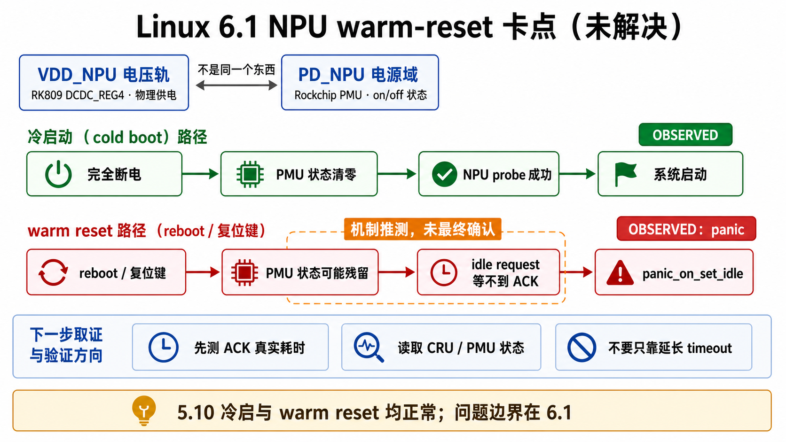

# 02 - 6.1 NPU / PD_NPU warm-reset panic（开放问题）

> 状态：`[BSP-6.1 OBSERVED / NOT RESOLVED]` —— 这是 6.1 路线当前需要继续定位的重要风险。根因尚未修好；BSP 5.10 的正常行为用于对照，不表示 BSP 6.1 路线被取代。



图中冷启动成功和 warm reset panic 是已观察事实；“PMU 状态残留导致 ACK 不返回”仍是机制推测，并未画成最终根因。

## 现象

- **冷启动**（flash 后首次上电）：正常进系统，NPU probe 成功。
- **warm reset**（`reboot` / 复位键）：下一次启动在早期就 panic：

```text
rk_iommu_driver_init → rockchip_pd_power_on → rockchip_pmu_set_idle_request
not syncing: panic_on_set_idle set
```

**5.10 完全没有这个问题**——冷启 + reset 都正常，NPU 完全可用。所以这是 **6.1 kernel source 的问题**，不是板子/固件。

## 关键概念区分：VDD_NPU 电压轨 ≠ PD_NPU 电源域

调试时严禁把两者等同（这是反复踩的坑）：

1. **VDD_NPU 电压轨**（RK809 `DCDC_REG4`）：NPU 的物理供电。
2. **PD_NPU 电源域**（Rockchip PMU `PWRDN_CON` bit1）：电源开关/域 on/off。

两者由不同代码路径控制，可互相矛盾。GEC 6.1 DTS 里 `vdd_npu` 有 `regulator-always-on` + `regulator-boot-on`，所以**轨在 Linux 里物理常开**；PD 驱动不碰 VDD_NPU（无 `npu-supply`，`devm_regulator_get_optional` 返回 -ENODEV 跳过）。VDD_NPU 的 enable 只归 RKNPU 驱动（`rknpu-supply`）。

> U-Boot 日志 `vdd_npu init 900000 uV` 只证明 bootloader 配了轨，**不证明** PD_NPU 已上电，反之亦然。判断「电压正常」绝不能只看这一行。

## 机制（推测，未最终确认）

- warm reset 不会复位 RK3568 PMU 电源域逻辑。
- 上一轮 NPU-on 的 6.1 内核把 PD_NPU 留在 powered 状态 → 粘滞。
- 下次启动的 PMU idle 握手（`rockchip_pmu_set_idle_request` 等 BUS_IDLE_ACK/ST）永远不 ACK → 超时 → `panic_on_set_idle`（debug flag）硬 panic。
- 冷断电清掉这个状态，所以冷启首启总是正常。

**为什么 5.10 没事、6.1 有**：6.1 的 PMU/genpd idle-request 处理（或 `panic_on_set_idle` flag/超时行为）与 5.10 不同——这是 6.1 源码差异，未定位到具体行。

## 调试方法与结论（沉淀的方法论）

1. **先实测，再下结论**：没测过 NIU ACK 真实耗时时，不能提前宣布「延长 10ms 超时就是修复」。ACK 是「慢（>10ms，加超时是正解）」还是「永远不响应（硬时钟/硬件问题，加超时只是掩盖）」是两种完全不同的修复，必须先用 `ktime_get_ns()` 打点实测。
2. **寄存器只读观测**：`rockchip_softrst_ops` 没有 `.status` op，`reset_control_status()` 返回 -ENOSYS，只能 raw read 观测。
3. **CRU bit 映射**（`CRU base = 0xfdd20000`，从 6.1 源码重推，勿信旧 bit 号）：
   - `CLKGATE_CON(3)` = `0xfdd2030c`（GFLAGS = HIWORD_MASK | CLK_GATE_SET_TO_DISABLE，raw=1→gated）：bit2=HCLK_NPU_PRE、bit3=PCLK_NPU_PRE、bit4=ACLK_NPU_PRE、bit7=ACLK_NPU、bit8=HCLK_NPU
   - `SOFTRST_CON(2)` = `0xfdd20408`（assert 写 BIT、deassert 清；raw=1→asserted）：bit8=SRST_A_NPU_NIU、bit9=SRST_H_NPU_NIU、bit10=SRST_P_NPU_NIU、bit11=SRST_A_NPU、bit12=SRST_H_NPU

## 后续修复方向

- (a) 在 U-Boot restart 路径强制 PD_NPU 掉电。
- (b) 给 6.1 的 `rockchip_pd_power_on` 加超时/reset 容忍。
- (c) 查清为什么 6.1 会让 PD_NPU 粘滞而 5.10 不会。

## 另一个被掩盖的坑：启动方法

早期「所有自编镜像都启动不了」其实**不是** NPU/板子/固件问题，是**启动方法错了**：

- 错：`mmc read 0x0a000000 0x8000 0x10000; bootm 0x0a000000 - 0x0b000000`（把内核解压到固定 0x04000000、DTB 传 0x0b000000）。
- 对：用 Rockchip 原生 `boot_fit`（理解 `0xffffff01/0xffffff00` in-place 标记的 Rockchip 风格 FIT）。
- 铁证：把厂商已知可用的 6.1.172 内核重打包进我们的 FIT、用同样错误方法 boot，同样 Synchronous Abort。

**这条通用教训**：Rockchip 板要用 `boot_fit` + Rockchip `mkimage` 打的 FIT，不要用 stock u-boot-tools 的 `bootm` 硬搬。

## 4.19 baseline 的坑

本地 4.19 树是 **4.19.219**，但已验证正常的 factory 是 **4.19.232**——不要把 4.19.219 当 baseline 去对比 6.1 的 NPU 行为（4.19.232 源码机器上没有，4.19 侧排查被暂停）。
