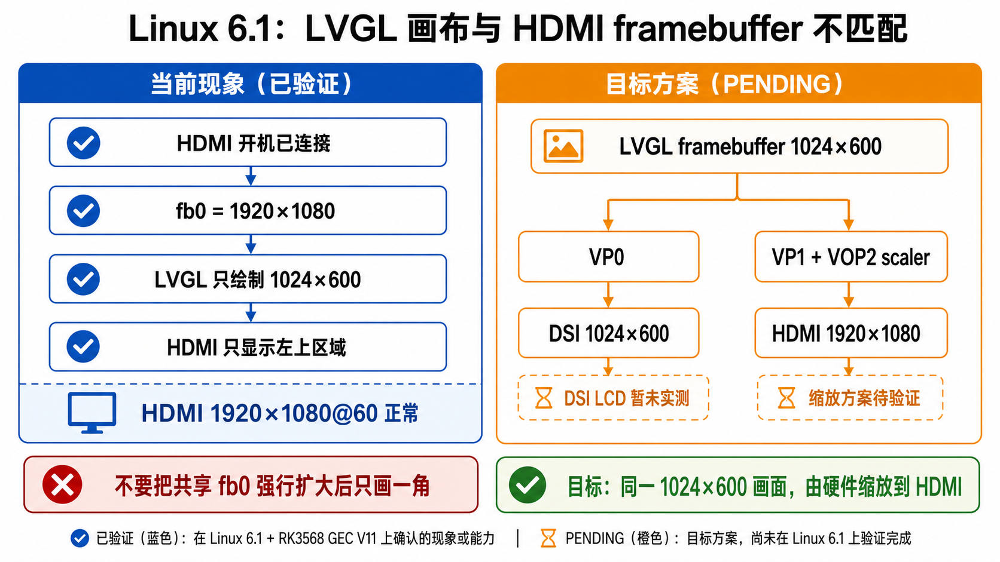

# 04 - 6.1 framebuffer、HDMI 与 LVGL 进展（2026-08-27）

> 状态：`[BSP-6.1 RUNTIME VERIFIED]` 到 fb0 / HDMI；DSI LCD 暂未测试，双屏 LVGL 显示策略仍为 `[PENDING]`。
> 本文记录 LubanCat Linux 6.1 SDK 上的 GEC V11 专用 defconfig、fbdev 恢复、HDMI 验证与当前剩余问题。



## 1. 板级构建配置

当前 SDK BoardConfig 已切到 GEC 专用内核配置：

```text
RK_KERNEL_PREFERRED="6.1"
RK_KERNEL_CFG="rockchip_rk3568_gec_linux_defconfig"
RK_KERNEL_DTS_NAME="rk3568-evb1-gec-v11-linux"
RK_USE_FIT_IMG=y
```

因此 kernel 构建使用自定义 GEC defconfig 和 GEC DTS，不再回退到 `rockchip_linux_defconfig`。

## 2. fb0 问题已解决

最初 Linux 6.1 启动后没有 `/dev/fb0`。根因是 6.1 中 `DRM_FBDEV_EMULATION` 的 Kconfig 依赖发生变化，单纯启用 DRM / KMS 不再像旧版本那样自动满足 fbdev 依赖。

GEC defconfig 中补充：

```text
CONFIG_FB=y
```

重新生成 `.config` 后确认：

```text
CONFIG_DRM=y
CONFIG_DRM_KMS_HELPER=y
CONFIG_DRM_FBDEV_EMULATION=y
CONFIG_DRM_FBDEV_OVERALLOC=100
CONFIG_DRM_ROCKCHIP=y
CONFIG_FB=y
```

内核日志：

```text
[drm] Initialized rockchip ...
[drm] fb0: rockchipdrmfb frame buffer device
```

Buildroot 用户空间也成功打开 framebuffer：

```text
Starting launcher: The framebuffer device was opened successfully.
1024x600, 32bpp
The framebuffer device was mapped to memory successfully.
```

结论：`/dev/fb0` 问题已解决，之前 8/24 记录中的 “framebuffer 打不开 / 屏不亮” 需要以本文的新状态为准。

## 3. defconfig 第一轮精简

原 GEC defconfig 基本是 Rockchip 通用 defconfig 加板级配置。第一轮先删除非 RK3568 SoC：

```text
CONFIG_CPU_PX30
CONFIG_CPU_RK1808
CONFIG_CPU_RK3328
CONFIG_CPU_RK3399
CONFIG_CPU_RK3528
CONFIG_CPU_RK3562
CONFIG_CPU_RK3576
CONFIG_CPU_RK3588
```

最终 `.config` 中只保留：

```text
CONFIG_CPU_RK3568=y
```

启动日志确认 RK3568 四核正常：

```text
CPU1: Booted secondary processor
CPU2: Booted secondary processor
CPU3: Booted secondary processor
smp: Brought up 1 node, 4 CPUs
SMP: Total of 4 processors activated.
```

精简后 `boot.img` 从约 39 MB 减少到约 37 MB。

## 4. Camera 配置精简

已删除当前板卡不用的一批 camera sensor 和视频桥接驱动：

```text
CONFIG_VIDEO_GC8034
CONFIG_VIDEO_IMX415
CONFIG_VIDEO_IMX464
CONFIG_VIDEO_OS04A10
CONFIG_VIDEO_OV13850
CONFIG_VIDEO_OV13855
CONFIG_VIDEO_OV4689
CONFIG_VIDEO_OV50C40
CONFIG_VIDEO_OV5695
CONFIG_VIDEO_OV7251
CONFIG_VIDEO_SC4336
CONFIG_VIDEO_LT6911UXC
CONFIG_VIDEO_LT6911UXE
CONFIG_VIDEO_LT7911D
CONFIG_VIDEO_TC35874X
CONFIG_VIDEO_RK628_CSI
CONFIG_VIDEO_RK628_BT1120
```

保留 Rockchip CSI / ISP 框架。启动后仍可看到框架 probe：

```text
rockchip-csi2-dphy ... probe successfully
rockchip-mipi-csi2-hw ... probe success
rkisp driver version: v02.09.00
rkisp-vir0: update sensor failed
```

由于当前未接具体 sensor，`update sensor failed` 属预期，不影响系统启动。

## 5. HDMI 1080p 已验证，DSI LCD 暂未测试

HDMI EDID 读取正常，显示器状态为：

```text
connected
```

`modetest -M rockchip -c` 显示 HDMI 支持 32 个模式，其中首选模式：

```text
1920x1080@60
type: preferred, driver
```

因此 HDMI 硬件、EDID、PHY、VOP2 本身没有问题。

当前测试条件下 **DSI LCD 还没有实测**。本文里的显示验证结论只覆盖 HDMI 和 fbdev，不把 DSI LCD 标记为 6.1 已验证。

如果系统启动时 HDMI 未连接，先由 1024x600 的 fbdev 初始尺寸创建 `fb0`，之后再热插拔 HDMI，HDMI 会自动落到：

```text
800x600@75
```

日志：

```text
Update mode to 800x600p75 ... for vp1 dclk: 49500000
```

原因是 HDMI 后插时沿用了已经创建好的 1024x600 framebuffer。HDMI 支持的模式中，能够塞进 1024x600 framebuffer 的较大模式就是 800x600，所以热插拔时 fbdev helper 选择了 800x600。

如果 HDMI 在开机前已连接，系统能直接根据 EDID 选择：

```text
1920x1080p60
```

日志：

```text
Update mode to 1920x1080p60 ... for vp1 dclk: 148500000
set dclk_vop1 to 148500000, get 148500000
```

结论：HDMI 1920x1080@60 本身已验证正常。

## 6. 双屏目标与待验证状态

期望最终双屏状态是：

```text
Video Port0: ACTIVE
Connector: DSI-1
Display mode: 1024x600p60
src: 1024x600
dst: 1024x600

Video Port1: ACTIVE
Connector: HDMI-A-1
Display mode: 1920x1080p60
src: 1920x1080
dst: 1920x1080
```

目标 VP 分配：

```text
VP0 -> DSI
VP1 -> HDMI
```

但当前测试条件下 DSI LCD 未接入 / 未实测，所以以上仍是目标状态，不应写成已验证事实。

在 HDMI 已连接启动的验证中，fbdev framebuffer 观察到：

```text
buf addr = 0x7e098000
pitch = 7680
```

`pitch=7680`，XR24 为 4 bytes/pixel，因此 framebuffer 实际行宽：

```text
7680 / 4 = 1920 pixels
```

也就是说，HDMI 已连接启动时，fbdev 创建的 framebuffer 实际已接近 1920x1080。

## 7. 当前 LVGL 问题

LVGL 程序仍固定按：

```text
LV_HOR_RES_MAX=1024
LV_VER_RES_MAX=600
```

绘制。

当前实际情况：

```text
shared fb0 = 1920x1080
LVGL only draws 1024x600
```

所以 HDMI 1920x1080 显示器上只看到 LVGL 的一部分，剩余区域没有被 LVGL 绘制。

当前问题已经不是 HDMI 分辨率或 framebuffer 创建失败，而是：

```text
HDMI fb0 = 1920x1080
LVGL 固定只绘制 1024x600
```

DSI + HDMI 不同分辨率双屏共用 fbdev framebuffer 的问题，是下一步接入 DSI LCD 后需要验证的方向。

## 8. 目标方案

期望最终效果：

```text
DSI  -> 1024x600   （待 DSI LCD 实测）
HDMI -> 1920x1080  （已验证）
```

LVGL 仍只维护 1024x600 画面，然后：

```text
VP0: src 1024x600 -> dst 1024x600 -> DSI
VP1: src 1024x600 -> VOP2 hardware scaling -> dst 1920x1080 -> HDMI
```

即利用 RK3568 VOP2 hardware scaler，把同一份 1024x600 LVGL framebuffer 放大到 HDMI 1920x1080，而不是让 fbdev 把共享 framebuffer 本身扩成 1920x1080。

## 9. 后续可精简候选

启动日志中还发现：

```text
drivers/gpu/arm/mali400/...
Mali device driver loaded
```

真正的 RK3568 Mali-G52 Bifrost 已正常：

```text
mali fde60000.gpu ...
GPU identified ...
Probed as mali0
```

下一步可考虑删除：

```text
CONFIG_MALI400
CONFIG_MALI450
```

另外当前：

```text
CONFIG_NR_CPUS=8
```

实际 RK3568 只有 4 核，可考虑改为：

```text
CONFIG_NR_CPUS=4
```

RK817 battery / charger、部分 UART、音频 codec、其他外设驱动可后续逐步精简。

## 10. 其他非阻塞问题

目前仍有一些独立问题，但与本次 framebuffer / HDMI 主问题无直接关系：

```text
Goodix I2C communication failure
RTL8723DS module/rootfs loading 脚本异常
cfg80211 regulatory.db missing
RK817 battery/charger no matching DT node
```

## 11. 当前结论

```text
1. Linux 6.1 fb0 已恢复
2. GEC 专用 defconfig 精简有效
3. RK3568 四核、eMMC、USB、Ethernet、DRM、HDMI 均正常；DSI LCD 暂未测试
4. HDMI 1920x1080@60 本身正常
5. 当前剩余核心问题是 HDMI 1920x1080 framebuffer 与 LVGL 固定 1024x600 绘制范围不匹配
6. 下一步在接入 DSI LCD 后，再研究 DRM/VOP2 plane scaling，让 1024x600 framebuffer 在 HDMI VP1 上硬件缩放到 1920x1080
```
