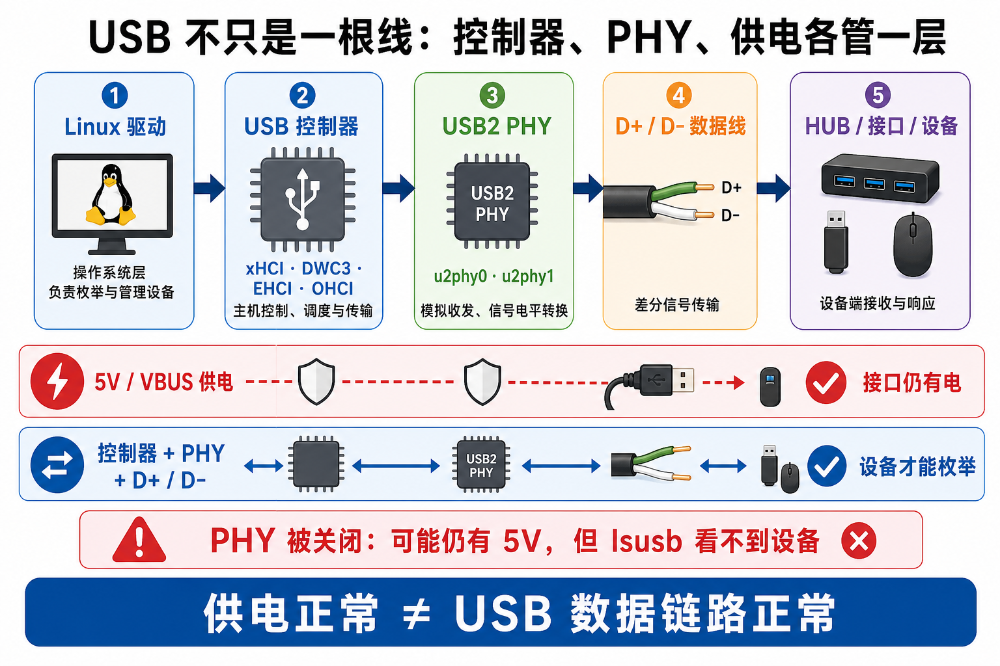
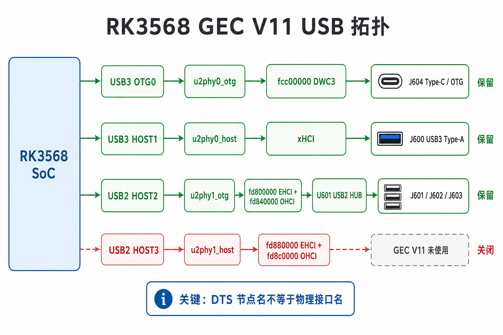
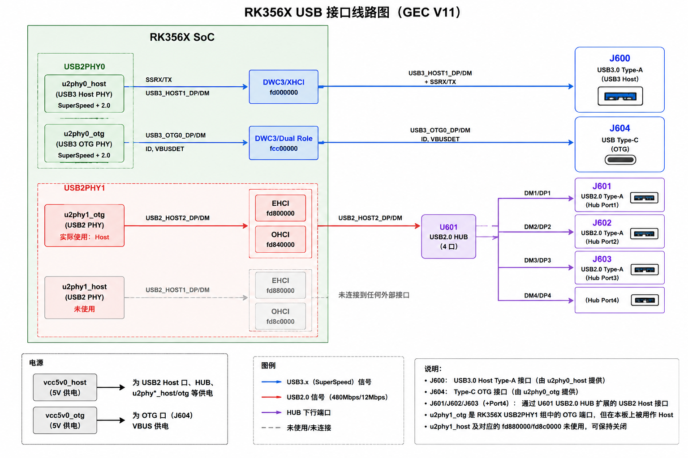
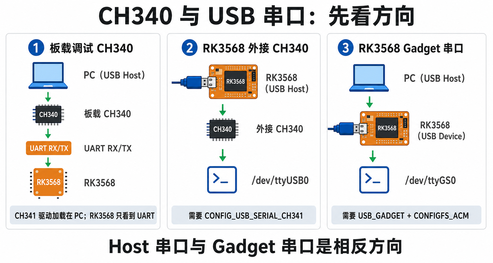
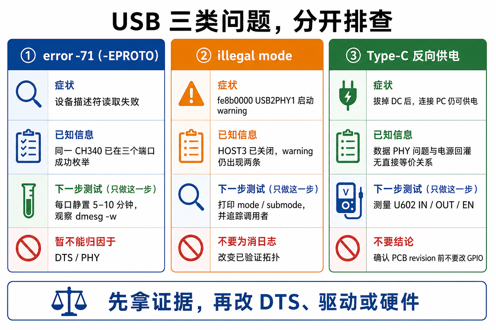

# 06 - RK3568 GEC V11 USB 图解

> 这篇只负责解释 USB 结构。裁剪结论、实验记录与 warning 状态以 [05 - 内核裁剪与板级验证日志](05_kernel_trim_validation_log.md) 为准。

## 先记住三件事

1. `host` / `otg` 是 DTS 和控制器视角的名字，不一定等于板上插座名称。
2. USB 供电和 USB 数据是两条相关但不同的链路；接口有 5 V，不代表设备一定能够枚举。
3. 判断 CH340 驱动装在哪一端，先看谁是 USB Host。

## 控制器、PHY、数据线和供电



一条 USB 数据链路至少需要：Linux 驱动、USB 控制器、PHY、D+/D- 或 SuperSpeed 信号线、连接器和设备。VBUS 可以单独存在，所以关闭 PHY 后出现“接口仍有电，但 `lsusb` 看不到设备”并不矛盾。

## GEC V11 的实际 USB 拓扑



最容易记错的是 `u2phy1_otg`：它在 GEC V11 上实际服务 USB2 HOST2，再经过 U601 HUB 扩展到 J601、J602、J603。因此它必须保留。真正未使用并已验证可关闭的是 `u2phy1_host` 对应的 USB2 HOST3。

### 接口、控制器与信号线路明细



这张图进一步展开控制器地址、DP/DM、SuperSpeed 信号、U601 HUB 下游端口以及 VBUS 供电来源。它用于查线和定位接口，不替代上图的“保留 / 关闭”裁剪结论。

## CH340 与 USB 串口方向



板载调试 CH340 和外接 CH340 不是同一种软件关系：

- 板载 CH340：PC 是 USB Host，CH341 驱动加载在 PC；RK3568 侧只使用 UART。
- 外接 CH340：RK3568 是 USB Host，需要 `CONFIG_USB_SERIAL_CH341`，设备注册为 `/dev/ttyUSB0`。
- Gadget 串口：RK3568 是 USB Device，通常由 `USB_GADGET` 与 `CONFIGFS_ACM` 提供 `/dev/ttyGS0`。

## 三类问题必须分开排查



当前证据只支持以下判断：

- `error -71`：属于 USB 协议错误；同一 CH340 已在三个口成功枚举，所以暂不能直接归因于 DTS / PHY。
- `illegal mode`：HOST3 关闭后 warning 仍存在，应先打印 `mode` / `submode` 并追踪调用者。
- Type-C 反向供电：属于电源路径问题，应测量 U602 `IN` / `OUT` / `EN`，不能和数据 PHY warning 混为一谈。

## 当前最小测试

对 J601、J602、J603 分别插入 CH340，保持静置 5 到 10 分钟：

```bash
dmesg -w | grep -iE 'usb|ch341|ttyUSB|error -71|disconnect|power cycle'
```

本轮只记录稳定性，不修改 DTS 或 PHY 配置。
