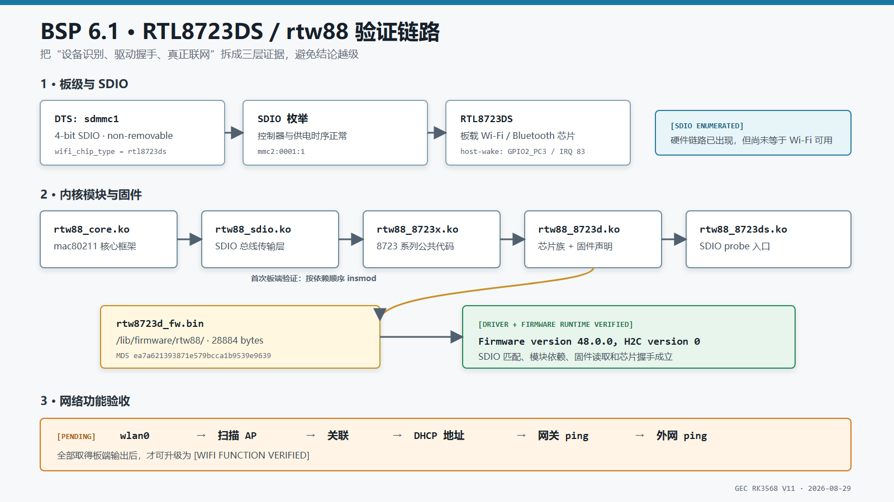

# 07 - RTL8723DS Wi-Fi / rtw88 验证（2026-08-29）

> 状态：`[BSP-6.1 DRIVER + FIRMWARE RUNTIME VERIFIED]`
>
> 已验证到 RTL8723DS SDIO 设备匹配、rtw88 五模块按依赖顺序加载、芯片固件握手成功，并已出现 `wlan0`。尚未提供扫描、关联 AP、DHCP 和 ping 的板端输出，因此本页**不写成 Wi-Fi 联网完全跑通**。



## 结论

BSP 6.1 不包含 5.10 那套 Realtek vendor `rtl8723ds` 源码，也不会生成旧脚本期待的 `8723ds.ko`。当前采用 6.1 内核自带的 mac80211 `rtw88` 驱动：

```text
CONFIG_RTW88=m
CONFIG_RTW88_8723DS=m
```

Kconfig 会继续选中 `RTW88_CORE`、`RTW88_SDIO`、`RTW88_8723X` 和 `RTW88_8723D`，最终生成五个模块。2026-08-29 手工按依赖顺序加载后，板端出现：

```text
rtw_8723ds mmc2:0001:1: Firmware version 48.0.0, H2C version 0
```

这证明 SDIO 设备、驱动 probe 和固件下载链已经成立。

## 源码与配置核查

### Vendor 驱动不存在

- 6.1 的 `drivers/net/wireless/` 下没有完整 vendor `rtl8723ds` 目录。
- 5.10 的 `drivers/net/wireless/rockchip_wlan/rtl8723ds/` 才有 `core/hal/os_dep/platform/include` 等完整源码，通常作为外部模块生成 `8723ds.ko`。
- 不从 5.10 搬 vendor 驱动到 6.1：旧 cfg80211 / netdev API 适配成本高，且 6.1 已有原生 rtw88 支持。

### 当前维护配置

WSL 中实际核查：

```text
arch/arm64/configs/rockchip_rk3568_gec_linux_defconfig:
CONFIG_RTW88=m
CONFIG_RTW88_8723DS=m
CONFIG_RTW88_DEBUG=y
CONFIG_RTW88_DEBUGFS=y
```

最终 `.config` 展开为：

```text
CONFIG_RTW88=m
CONFIG_RTW88_CORE=m
CONFIG_RTW88_SDIO=m
CONFIG_RTW88_8723X=m
CONFIG_RTW88_8723D=m
CONFIG_RTW88_8723DS=m
```

`RTW88_DEBUG` / `DEBUGFS` 当前用于 bring-up，联网稳定后再单独评估是否裁剪。

## DTS 与 SDIO 证据

GEC DTS 已声明：

```text
wifi_chip_type = "rtl8723ds"
SDIO controller = sdmmc1
runtime SDIO device = mmc2:0001:1
WIFI,host_wake_irq = gpio2 RK_PC3 / irq 83
```

启动日志可见 WLAN RFKill 解析到 `rtl8723ds`、Wi-Fi 上电以及 host-wake IRQ。`The ref_wifi_clk not found` 仍作为 warning 保留，但它没有阻止本次 SDIO 枚举和固件握手。

## 五个模块及依赖

| 模块 | 作用 | `modinfo depends` |
|------|------|-------------------|
| `rtw88_core.ko` | mac80211 核心、固件和收发框架 | 无 |
| `rtw88_sdio.ko` | SDIO 总线传输层 | `rtw88_core` |
| `rtw88_8723x.ko` | 8723 系列公共代码 | `rtw88_core` |
| `rtw88_8723d.ko` | 8723D 芯片族代码 | `rtw88_core,rtw88_8723x` |
| `rtw88_8723ds.ko` | 8723DS SDIO probe 入口 | `rtw88_sdio,rtw88_8723d` |

五个模块的 `vermagic` 均为：

```text
6.1.99 SMP mod_unload aarch64
```

## 固件

rtw88 需要：

```text
/lib/firmware/rtw88/rtw8723d_fw.bin
```

SDK 已有两份相同固件：

```text
ubuntu22.04/overlay-firmware/usr/lib/firmware/rtw88/rtw8723d_fw.bin
debian11/overlay-firmware/usr/lib/firmware/rtw88/rtw8723d_fw.bin
```

核查值：

```text
size = 28884 bytes
md5  = ea7a621393871e579bcca1b9539e9639
```

## 两次加载实验

### 实验 A：编入内核

曾将 rtw88 全部配置为 `=y`。驱动成功匹配 `mmc2:0001:1`，但 probe 发生在 rootfs 挂载前：

```text
[    3.548158] rtw_8723ds mmc2:0001:1: Direct firmware load for rtw88/rtw8723d_fw.bin failed with error -2
[    3.580632] VFS: Mounted root (ext4 filesystem)
```

因此固件即使位于 rootfs 的 `/lib/firmware`，早期 probe 也无法读取。若坚持内置，必须使用 `CONFIG_EXTRA_FIRMWARE` 或 initramfs 提前提供固件。

### 实验 B：模块化加载

重新烧写 `RTW88=m` 的内核后，将固件放进 rootfs，并按顺序执行：

```bash
insmod rtw88_core.ko
insmod rtw88_sdio.ko
insmod rtw88_8723x.ko
insmod rtw88_8723d.ko
insmod rtw88_8723ds.ko
```

结果：`Firmware version 48.0.0, H2C version 0`，判定 `[RUNTIME VERIFIED]`。

## 模块安装位置与自动加载现状

标准持久化位置：

```text
/lib/modules/6.1.99/kernel/drivers/net/wireless/realtek/rtw88/
```

板端 BusyBox 没有 `depmod`，最初执行 `modprobe rtw88_8723ds` 报 `modules.dep` 不存在。之后补充依赖表，`modprobe` 又在加载 `rtw88_8723d.ko` 时出现 `Unknown symbol`。当前只确认手工 `insmod` 顺序可靠；BusyBox `modprobe` 的依赖解析 / 加载顺序仍是 `[OPEN]`，不能写成已解决。

可在构建主机生成完整模块元数据后随 rootfs 安装，也可以暂时在启动脚本中按已验证顺序加载五个模块。自动加载方案必须再次重启验证。

## 旧启动脚本问题

板端 `/etc/init.d/S36load_wifi_modules` 仍包含旧 vendor 驱动残留：

```text
//insmod/system/lib/modules/"8723ds.ko"
```

该行同时存在：

1. shell 命令格式错误；
2. `/system/lib/modules/` 路径不符合当前标准模块布局；
3. 6.1 根本没有生成 `8723ds.ko`。

本轮未修改该脚本。后续固化时应改为经过重启验证的 rtw88 加载流程，并避免假定固定 `rfkill1` 索引。

## 完整复现实验

下面给出从 WSL 编译、电脑与开发板直连，到传输、加载和联网验证的完整步骤。示例环境：

| 项目 | 示例值 |
|------|--------|
| WSL SDK | `/home/hyl/lubancat-linux-sdk` |
| 内核源码 | `/home/hyl/lubancat-linux-sdk/kernel-6.1` |
| 运行内核 | `6.1.99` |
| 板端有线接口 | `eth0` |
| 开发板直连地址 | `192.168.50.10/24` |
| Windows 有线地址 | `192.168.50.20/24` |

这里特意使用独立的 `192.168.50.0/24` 网段。若电脑的 Wi-Fi 或路由器已经使用 `192.168.1.0/24`，再给直连以太网配置同一网段，Windows 可能选错路由。

### 1. 确认维护配置

在 WSL 中进入内核源码：

```bash
SDK=/home/hyl/lubancat-linux-sdk
KERNEL=$SDK/kernel-6.1
TC=$SDK/prebuilts/gcc/linux-x86/aarch64/gcc-arm-10.3-2021.07-x86_64-aarch64-none-linux-gnu/bin/aarch64-none-linux-gnu-

cd "$KERNEL"
grep -E '^CONFIG_RTW88|^CONFIG_MAC80211|^CONFIG_CFG80211' \
  arch/arm64/configs/rockchip_rk3568_gec_linux_defconfig
```

当前维护配置中至少应包含：

```text
CONFIG_RTW88=m
CONFIG_RTW88_8723DS=m
CONFIG_RTW88_DEBUG=y
CONFIG_RTW88_DEBUGFS=y
```

`CONFIG_RTW88_8723DS=m` 会通过 Kconfig 选择所需的 `RTW88_CORE`、`RTW88_SDIO`、`RTW88_8723X` 和 `RTW88_8723D`。重新生成 `.config` 后再核对实际展开结果：

```bash
make ARCH=arm64 rockchip_rk3568_gec_linux_defconfig
make ARCH=arm64 CROSS_COMPILE="$TC" olddefconfig
grep -E '^CONFIG_RTW88' .config
```

预期主要结果：

```text
CONFIG_RTW88=m
CONFIG_RTW88_CORE=m
CONFIG_RTW88_SDIO=m
CONFIG_RTW88_8723X=m
CONFIG_RTW88_8723D=m
CONFIG_RTW88_8723DS=m
```

不要只修改临时 `.config`。最终选项必须同步到 `rockchip_rk3568_gec_linux_defconfig`，否则执行 defconfig 或清理构建目录后会丢失。

### 2. 编译内核和 rtw88 模块

先编译模块：

```bash
cd "$KERNEL"
make -j"$(nproc)" ARCH=arm64 CROSS_COMPILE="$TC" modules
```

如果本轮把 rtw88 从内置 `=y` 改回模块 `=m`，还必须重新编译并烧写内核镜像，确保开发板正在运行的 Image 与这些模块来自同一份配置和源码：

```bash
cd "$SDK"
./build.sh kernel
```

按当前 SDK 的正常流程烧写新生成的 `boot.img`。若开发板仍运行 rtw88 内置版本，再执行 `insmod rtw88_core.ko` 可能出现重复符号或 `File exists`，此时不能继续用模块实验结果作判断。

### 3. 检查编译产物和版本

```bash
cd "$KERNEL"
find drivers/net/wireless/realtek/rtw88 -maxdepth 1 -type f \
  \( -name 'rtw88_core.ko' -o -name 'rtw88_sdio.ko' \
     -o -name 'rtw88_8723x.ko' -o -name 'rtw88_8723d.ko' \
     -o -name 'rtw88_8723ds.ko' \) -ls

for module in \
  rtw88_core.ko rtw88_sdio.ko rtw88_8723x.ko \
  rtw88_8723d.ko rtw88_8723ds.ko; do
    modinfo "drivers/net/wireless/realtek/rtw88/$module" \
      | grep -E '^(filename|firmware|depends|vermagic):'
done
```

五个模块的 `vermagic` 必须一致，并与开发板 `uname -r` 对应。当前已验证值是：

```text
6.1.99 SMP mod_unload aarch64
```

检查固件：

```bash
FW=$SDK/ubuntu22.04/overlay-firmware/usr/lib/firmware/rtw88/rtw8723d_fw.bin
ls -l "$FW"
md5sum "$FW"
```

当前固件预期大小为 `28884` 字节，MD5 为 `ea7a621393871e579bcca1b9539e9639`。

### 4. 从 WSL 暂存到 Windows

WSL2 通常经过虚拟 NAT，未必能直接访问插在 Windows 物理网卡上的开发板。最稳妥的方式是先把文件放到 Windows 目录，再由 Windows PowerShell 执行 SCP。

```bash
STAGE=/mnt/c/Users/17937/Desktop/rtw88-rk3568
mkdir -p "$STAGE"

cp "$KERNEL"/drivers/net/wireless/realtek/rtw88/rtw88_core.ko "$STAGE"/
cp "$KERNEL"/drivers/net/wireless/realtek/rtw88/rtw88_sdio.ko "$STAGE"/
cp "$KERNEL"/drivers/net/wireless/realtek/rtw88/rtw88_8723x.ko "$STAGE"/
cp "$KERNEL"/drivers/net/wireless/realtek/rtw88/rtw88_8723d.ko "$STAGE"/
cp "$KERNEL"/drivers/net/wireless/realtek/rtw88/rtw88_8723ds.ko "$STAGE"/
cp "$FW" "$STAGE"/

ls -lh "$STAGE"
```

目录中应有五个 `.ko` 和一个 `rtw8723d_fw.bin`。

### 5. 电脑和开发板配置直连 IP

用网线连接开发板网口与电脑有线网口。千兆网卡通常支持 Auto MDI-X，不需要交叉线。

先在开发板串口终端配置 `eth0`：

```bash
killall dhcpcd 2>/dev/null || true
ip link set eth0 up
ip addr replace 192.168.50.10/24 dev eth0
ip addr show dev eth0
```

若旧版 `ip` 不支持 `replace`，可使用：

```bash
ip addr add 192.168.50.10/24 dev eth0
```

然后以管理员身份打开 Windows PowerShell，先确认有线网卡名称：

```powershell
Get-NetAdapter
```

假设名称是 `以太网`，配置静态地址：

```powershell
netsh interface ip set address name="以太网" static 192.168.50.20 255.255.255.0
ipconfig
ping 192.168.50.10
```

若网卡名称不是 `以太网`，必须替换为 `Get-NetAdapter` 显示的实际名称。直连网段不需要配置默认网关和 DNS。

回到板端做反向检查：

```bash
ping -c 3 192.168.50.20
ps | grep '[d]ropbear'
netstat -lnt 2>/dev/null | grep ':22'
```

启动日志中已有 Dropbear 时，22 端口应处于监听状态。若 Windows 能 ping 板卡但 SCP 超时，应先检查 Dropbear 是否运行以及 Windows 防火墙对当前网卡配置文件的限制。

实验结束后，如需把 Windows 有线网卡恢复为 DHCP：

```powershell
netsh interface ip set address name="以太网" source=dhcp
```

### 6. 使用 SCP 传到开发板

在 Windows PowerShell 中执行：

```powershell
scp -r "$env:USERPROFILE\Desktop\rtw88-rk3568" root@192.168.50.10:/tmp/
```

首次连接会询问主机指纹，确认 IP 无误后输入 `yes`，再输入开发板 root 密码。传输完成后在板端检查：

```bash
ls -lh /tmp/rtw88-rk3568
md5sum /tmp/rtw88-rk3568/rtw8723d_fw.bin
```

若 Windows 没有 `scp` 命令，可在“可选功能”中安装 OpenSSH Client；这不是开发板内核问题。

### 7. 安装模块和固件

在开发板执行：

```bash
SRC=/tmp/rtw88-rk3568
KREL="$(uname -r)"
MODDIR=/lib/modules/$KREL/kernel/drivers/net/wireless/realtek/rtw88

mkdir -p "$MODDIR"
mkdir -p /lib/firmware/rtw88

cp "$SRC"/*.ko "$MODDIR"/
cp "$SRC"/rtw8723d_fw.bin /lib/firmware/rtw88/
chmod 0644 "$MODDIR"/*.ko /lib/firmware/rtw88/rtw8723d_fw.bin

ls -lh "$MODDIR"
ls -lh /lib/firmware/rtw88/rtw8723d_fw.bin
md5sum /lib/firmware/rtw88/rtw8723d_fw.bin
uname -r
```

这里的 `$KREL` 必须对应模块的 `vermagic`。若 Image 与模块来自不同构建，即使主版本都是 6.1，也可能因符号版本、配置或源码差异导致 `Invalid module format` 或 `Unknown symbol`。

### 8. 按依赖顺序手工加载

当前板端 BusyBox 缺少可靠的 `depmod/modprobe` 元数据处理，因此首次验证使用已确认的顺序：

```bash
cd "$MODDIR"

# 清理上一次手工加载；未加载时的错误可忽略。
rmmod rtw88_8723ds 2>/dev/null || true
rmmod rtw88_8723d  2>/dev/null || true
rmmod rtw88_8723x  2>/dev/null || true
rmmod rtw88_sdio   2>/dev/null || true
rmmod rtw88_core   2>/dev/null || true

insmod ./rtw88_core.ko
insmod ./rtw88_sdio.ko
insmod ./rtw88_8723x.ko
insmod ./rtw88_8723d.ko
insmod ./rtw88_8723ds.ko
```

不要把最后一个模块误写成旧 vendor 驱动的 `8723ds.ko`；BSP 6.1 本次加载的是 `rtw88_8723ds.ko`。

### 9. 验证驱动、SDIO 与固件

```bash
lsmod | grep rtw88
dmesg | grep -iE 'rtw|firmware|mmc2:0001:1|sdio'
ip link show
iw dev 2>/dev/null
```

本轮已经获得的关键证据：

```text
rtw_8723ds mmc2:0001:1: Firmware version 48.0.0, H2C version 0
```

它证明以下链路已成立：

```text
SDIO 枚举 -> rtw88_8723ds 匹配 -> 五模块依赖满足 -> 固件文件读取 -> 芯片固件握手
```

到这里可以标记 `[DRIVER + FIRMWARE RUNTIME VERIFIED]`，但还不能标记 Wi-Fi 网络功能完成。

### 10. 解除 RFKill 并扫描 AP

先查看 RFKill 状态：

```bash
rfkill list 2>/dev/null
```

若系统没有 `rfkill` 命令，可通过 sysfs 解除软件阻断，并且不要假定 WLAN 永远是 `rfkill1`：

```bash
for state in /sys/class/rfkill/rfkill*/state; do
    [ -w "$state" ] && echo 1 > "$state"
done
```

确认无线接口名。以下以 `wlan0` 为例，若实际名称不同应替换：

```bash
ip link show
iw dev
ip link set wlan0 up
iw dev wlan0 scan | grep -E 'SSID:|signal:'
```

若系统只有 Wireless Extensions 工具，也可临时使用：

```bash
ifconfig wlan0 up
iwlist wlan0 scan | grep -E 'ESSID|Signal'
```

扫描到周围 AP 才能把“射频收发和扫描”记为已验证。

### 11. 关联 AP、获取地址并通信

推荐使用 `wpa_supplicant` 工具链。以下是 WPA2-PSK 示例；若板端有 `wpa_passphrase`：

```bash
wpa_passphrase '你的SSID' '你的密码' > /tmp/wpa_supplicant.conf
wpa_supplicant -B -D nl80211 -i wlan0 -c /tmp/wpa_supplicant.conf
```

若没有 `wpa_passphrase`，可在临时文件中写入配置：

```bash
cat >/tmp/wpa_supplicant.conf <<'EOF'
ctrl_interface=/var/run/wpa_supplicant
update_config=0
network={
    ssid="你的SSID"
    psk="你的密码"
}
EOF

wpa_supplicant -B -D nl80211 -i wlan0 -c /tmp/wpa_supplicant.conf
```

配置位于 `/tmp`，重启后消失；测试日志不要记录真实 Wi-Fi 密码。随后获取 DHCP 地址：

```bash
udhcpc -i wlan0 -q -n
iw dev wlan0 link
ip addr show dev wlan0
ip route
```

先测试局域网网关，再测试外网 IP，避免把 DNS 问题误判为 Wi-Fi 驱动问题：

```bash
GATEWAY="$(ip route | awk '/default/ {print $3; exit}')"
echo "$GATEWAY"
ping -c 3 "$GATEWAY"
ping -c 3 8.8.8.8
```

需要验证 DNS 时再执行：

```bash
ping -c 3 www.baidu.com
```

### 12. 保存最终证据

联网成功后在板端生成一份不含密码的验收日志：

```bash
{
    date
    uname -a
    echo '=== modules ==='
    lsmod | grep rtw88
    echo '=== dmesg ==='
    dmesg | grep -iE 'rtw|firmware|mmc2:0001:1|sdio' | tail -n 100
    echo '=== link ==='
    iw dev wlan0 link
    echo '=== address ==='
    ip addr show dev wlan0
    echo '=== route ==='
    ip route
    echo '=== ping gateway ==='
    ping -c 3 "$GATEWAY"
    echo '=== ping internet ==='
    ping -c 3 8.8.8.8
} | tee /tmp/rtl8723ds_rtw88_final.txt
```

再传回 Windows：

```powershell
scp root@192.168.50.10:/tmp/rtl8723ds_rtw88_final.txt "$env:USERPROFILE\Desktop\"
```

最终状态必须按证据分级：

| 证据 | 可记录状态 |
|------|------------|
| SDIO 出现 `mmc2:0001:1` | `[SDIO ENUMERATED]` |
| 模块加载且出现固件版本 | `[DRIVER + FIRMWARE RUNTIME VERIFIED]` |
| `ip link show` 出现 `wlan0` | `[NETDEV REGISTERED]` |
| `wlan0` 存在并能扫描 AP | `[SCAN VERIFIED]` |
| 关联 AP 并获得 DHCP 地址 | `[ASSOCIATION + DHCP VERIFIED]` |
| 网关和外网 IP 均可 ping | `[WIFI FUNCTION VERIFIED]` |

当前项目已到 `[NETDEV REGISTERED]`。必须拿到扫描、关联、DHCP 和 ping 的板端输出后，才能升级为 `[WIFI FUNCTION VERIFIED]`。

## 常见问题

| 现象 | 优先检查 |
|------|----------|
| `Direct firmware load ... error -2` | 固件路径是否为 `/lib/firmware/rtw88/rtw8723d_fw.bin`；若驱动内置，还要检查 probe 是否早于 rootfs 挂载 |
| `Invalid module format` | 板端 `uname -r` 与模块 `vermagic`、Image 与模块是否来自同一次源码和配置 |
| `Unknown symbol` | 五模块是否混入其他构建产物，是否按依赖顺序加载；保存完整 `dmesg` |
| `modprobe: modules.dep not found` | BusyBox rootfs 未安装模块元数据；首次验证先按本文顺序 `insmod` |
| `insmod rtw88_core.ko` 报符号已存在 | 正在运行的 Image 可能仍把 rtw88 编入内核，需要烧写模块化配置生成的新 Image |
| 有固件版本但没有 `wlan0` | 检查 `dmesg` 中 mac80211、cfg80211、regulatory 和 netdev 注册错误，不要直接宣布 Wi-Fi 已跑通 |
| 扫描时报接口关闭或阻断 | 检查 `ip link set wlan0 up`、RFKill 状态和 WLAN 电源节点 |
| SCP 超时 | 检查网线链路、双方 IP、Windows 网卡名、防火墙和板端 Dropbear/22 端口 |
| 直连后路由异常 | 避免直连网卡与 Wi-Fi 使用相同子网，按本文改用 `192.168.50.0/24` |
