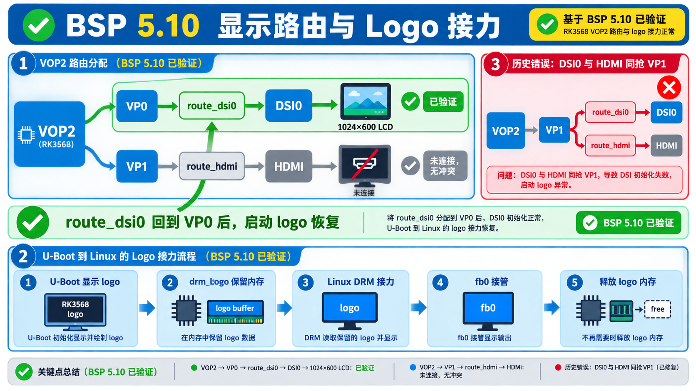

# BSP 5.10 DSI 启动 Logo 证据

状态：`[BSP-5.10 RUNTIME VERIFIED]`



## 结论

启动 logo 已成功显示。根因是 VOP route 分配错误：`route_dsi0` 曾被写到 VP1，与 HDMI route 的 VP1 分配冲突。修复为 DSI0 使用 VP0，HDMI 使用 VP1 后，U-Boot 阶段 DSI 初始化与 logo 显示恢复。

## DTS 分层

```text
rk3568-gec-v11.dtsi:424
&route_dsi0 {
    status = "okay";
    connect = <&vp0_out_dsi0>;
};

rk3568-evb-gec.dtsi:1509
&route_hdmi {
    status = "okay";
    connect = <&vp1_out_hdmi>;
};
```

## 关键日志

```text
Rockchip UBOOT DRM driver version: v1.0.1
VOP have 2 active VP
Using display timing dts
dsi@fe060000:  detailed mode clock 51200 kHz
VOP update mode to: 1024x600p60, type: MIPI0 for VP0
VP0 set crtc_clock to 51000KHz
final DSI-Link bandwidth: 336 Mbps x 4
hdmi@fe0a0000 disconnected
```

内核侧：

```text
rockchip-drm display-subsystem: bound fe0a0000.hdmi
rockchip-drm display-subsystem: bound fe060000.dsi
[drm] fb0: rockchipdrmfb frame buffer device
```

## 规则

不要把 DSI logo 失败直接归因到 panel timing 或 reserved-memory。先检查 route/VOP 分配：

```text
route_dsi0 -> vp0_out_dsi0
route_hdmi -> vp1_out_hdmi
```
