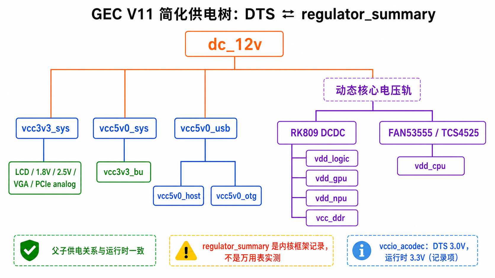

# 电源轨核对：DTS ⇄ 运行时 regulator_summary

采集来源：目标板 `cat /sys/kernel/debug/regulator/regulator_summary` + SDK `kernel-5.10/arch/arm64/boot/dts/rockchip/rk3568-evb-gec.dtsi`、`rk3568-gec-v11.dtsi`。

结论：**DTS 电源轨定义与运行时完全一致，仅 `vccio_acodec` 一处约束值偏差（无功能影响）。**

图中只表达已核对的父子供电关系和 regulator 来源；`regulator_summary` 的电压值仍是内核框架记录，不等于万用表实测。

## 关于 voltage 列的实时性

`regulator_summary` 的 `voltage` 是 regulator 框架记录的「当前生效电压」，非万用表实测：

- fixed regulator（如 `dc_12v`、`vcc3v3_sys`）= DTS 写死值，恒定
- DCDC（如 `vdd_logic`/`vdd_gpu`/`vdd_npu`/`vdd_cpu`）= consumer 驱动（CPUfreq/devfreq/dmc）经 `regulator_set_voltage()` 实时调整

验证方法：跑 `stress -c 4` 后再 dump，可见 `vdd_cpu`/`vdd_gpu` 等数字跳动。

## DTS ⇄ 运行时对照表

| 电源轨 | DTS min/max (mV) | 运行时 voltage (mV) | 一致 | 备注 |
|--------|-----------------|--------------------|------|------|
| dc_12v | 12000 | 12000 | ✅ | always-on |
| vcc3v3_sys | 3300 | 3300 | ✅ | ← dc_12v |
| vcc3v3_lcd0_n | 3300 | 3300 | ✅ | use=2 (DSI + 自身) |
| vcc3v3_lcd1_n | 3300 | 3300 | ✅ | use=0，第二路 LCD 未用（GEC 单屏） |
| vcc2v5-sys | 2500 | 2500 | ✅ | DDR 2.5V |
| vcc3v3_vga | 3300 (fixed GPIO) | 3300 | ✅ | use=1 |
| pcie30_avdd0v9 | 900 | 900 | ✅ | |
| pcie30_avdd1v8 | 1800 | 1800 | ✅ | |
| vdd_logic | 500–1350 | 850 | ✅ | use=5 (dmc/npu-bus/vdec/venc/自身) |
| vdd_gpu | 500–1350 | 825 | ✅ | use=2 |
| vcc_ddr | 500–1350 | 500 | ✅ | |
| vdd_npu | 500–1350 | 825 | ✅ | fde40000.npu-rknpu 已上电 |
| vcc_1v8 | 1800 | 1800 | ✅ | |
| vdda0v9_image | 900 | 900 | ✅ | |
| vdda_0v9 | 900 | 900 | ✅ | |
| vdda0v9_pmu | 900 | 900 | ✅ | |
| vccio_acodec | **3000** | **3300** | ⚠️ | 见下 |
| vccio_sd | 1800–3300 | 3300 | ✅ | dwmmc-vqmmc 拉满 |
| vcc3v3_pmu | 3300 | 3300 | ✅ | |
| vcca_1v8 | 1800 | 1800 | ✅ | saradc-vref |
| vcca1v8_pmu | 1800 | 1800 | ✅ | |
| vcca1v8_image | 1800 | 1800 | ✅ | |
| vcc_3v3 | switch | 3300 | ✅ | |
| vcc3v3_sd | switch | 3300 | ✅ | dwmmc-vmmc 3300–3400 |
| vcc5v0_sys | 5000 | 5000 | ✅ | |
| vcc5v0_usb | 5000 | 5000 | ✅ | |
| vcc5v0_host | 5000 | 5000 | ✅ | use=4 (USB phys) |
| vcc5v0_otg | 5000 | 5000 | ✅ | |
| vcc3v3_pcie | 3300 (GPIO) | 3300 | ✅ | 3c0800000.pcie-vpcie3v3 已挂 |
| vcc3v3_bu | 3300 | 3300 | ✅ | |

## 供电树（vin-supply 关系）核对

运行时树形父子链与 DTS `vin-supply` 完全吻合：

- `dc_12v` → `vcc3v3_sys` / `vcc5v0_sys` / `vcc5v0_usb` / `vcc3v3_pcie`
- `vcc3v3_sys` → `vcc3v3_lcd0_n` / `vcc3v3_lcd1_n` / `vcc2v5-sys` / `vcc3v3_vga` / `pcie30_avdd*` / `vcc_1v8` 等
- `vcc5v0_usb` → `vcc5v0_host` / `vcc5v0_otg`
- `vcc5v0_sys` → `vcc3v3_bu`

`3c0800000.pcie-vpcie3v3` 长地址 = `vcc3v3_pcie` 挂到 `pcie3x2` 的 `vpcie3v3-supply`（`rk3568-gec-v11.dtsi` &pcie3x2 节点），连接正确。

## vccio_acodec 偏差说明（记录，非 bug）

- DTS：`rk3568-evb-gec.dtsi` LDO_REG4 `regulator-min/max-microvolt = <3000000>`（3.0V）
- 运行时：显示 3300mV（min/max 均 3300，current 3300）

分析：该路为 RK809 LDO_REG4，硬件实际档位 3.3V，codec IO 正常工作在 3.3V。DTS 的 3000000 与硬件/驱动实际设定不符，但**不影响功能**，不需要进 known-issues。

可选修正（按"别大动 DTS"纪律，未执行）：将 DTS 改为 `<3300000>` 使其与硬件一致。待后续若动 DTS 时一并修正即可。

## 备注

- 本核对属记录性证据，非待修复项。
- `use` 计数合理：`vcc3v3_lcd1_n` use=0（未用）、`vdd_logic` use=5、`vcc5v0_host` use=4，均与板级设计吻合。
